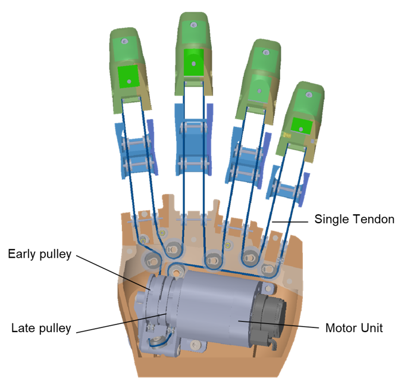
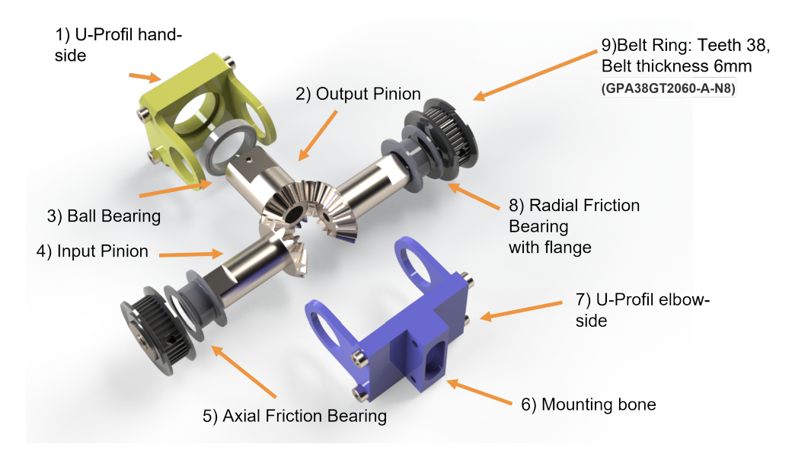

# Anthropomorphic Prosthesis for the Cybathlon Challenge



## Introduction to the Cybathlon Prosthesis

In the course of 2 Semesters, we, in a team of 3 people, designed and prototyped a robotic hand for the [Cybathlon competition](https://cybathlon.ethz.ch/de/events/challenges), aiming to realise an anthropomorphic prosthetic hand. The project was guided by the principle of anthropomorphism in robotics, focusing on emulating the appearance, motion, and sensory capabilities of the human hand. This approach led us to develop a prosthesis that not only met the functional requirements of the competition but also had a visually appealing, human-like design.

## Design and Development Process



The challenge of designing a robotic prosthesis can be divided into **four** different sub-assemblies, each with unique requirements and challenges:

 - ☝️ Finger
 - 🌴 Palm
 - 👋 Wrist
 - 🪵 Stump

As the responsibilities were split in the team, it was important to define **common interfaces** between each part.


Here you can see the final prototype including key design highlights in the build. In total, the prosthesis had a weight of 0.9kg which is comparable to state of the art prostheses.

The prosthesis design process involved substantial research and creative engineering to achieve the desired functionality and aesthetics. We focused on developing a gripping mechanism with a singular degree of freedom (DOF) but capable of performing both power and pinch grasp which are essential for the Cybathlon competition. Additionally, our wrist mechanism featured two DOFs, providing enhanced agility and functionality in grasping motions.

### Finger Mechanics and Dynamics

The fingers were designed with leaf springs for flexibility and underactuated movement, enabling them to adapt to the shape of the grasped object. The thumb, with its unique design, was integral to achieving effective grasping modes. The fingers and thumb were made adaptable, with their movement driven by a single tendon, ensuring simplicity and efficiency in the design.




To add torsional stiffness to the joint additonal cruciat ligaments where used similar to the ones present in a human knee joint.

### Palm Design and Tendon Routing

The palm was designed to serve as both the structural core and the aesthetic outer shell of the prosthesis similar to a monocouque in a race car. It housed the **motor unit**, **finger mounts**, and the **pulley system** essential for the **tendon-driven movement** of the fingers. The challenge was to integrate these mechanical elements within a design that mimicked the human palm's look and feel. By using lightweight materials like **Nylon** and **PLA**, we managed to balance mechanical functionality with an anthropomorphic appearance.

On the figure above you can see the tendon routing which enables two different adaptive grasping types. One where the thumb is delayed and therefore curls over the index finger **(power grasp)** and one where the timing of the fingers is tuned such that index finger and thumb meet directly **(pinch grasp)**.

### Wrist Mechanism: A Differential Approach


One of the project's highlights was the innovative wrist mechanism. Instead of assigning one motor for each DOF, we developed a differential wrist mechanism that connected both motors in the same power train. 

**Flexion** and **extension** can be achieved by rotating both motors in the same directions. **Pronation** and
**Supination** is realized if the motors are actuated in opposing directions.

This design allowed for simultaneous and continuous power allocation to both DOFs of the wrist. The motors, placed close to the stump interface, optimised weight distribution and reduced structural stress.

### Stump Interface: Enhancing Pilot Comfort

The stump interface, custom-fitted for the pilot, offered comfort and an additional passive rotational joint for ease of adjustment. This passive rotary mechanism allowed for easy, single-handed manipulation and provided a task-adaptable pronation/supination offset, significantly enhancing the pilot's comfort and the prosthesis's functionality.


A notable feature is the additional manual degree of freedom for the wrist. This improvement allows for heightened control and flexibility, enabling users to navigate their prosthetics with greater precision. In total, it introduces a 14-step rotation system with 25.7° increments. 
A robust, tight locking mechanism is integrated to prevent unintended movements. This feature ensures stability during various activities, addressing concerns related to reliability and safety in daily use.

## Documents

For a more detailed overview of the Design use the following link to get read the full report about this project.
[💾 Report](./images/Cybathlon_Group1_Report%20(1).pdf)

---

