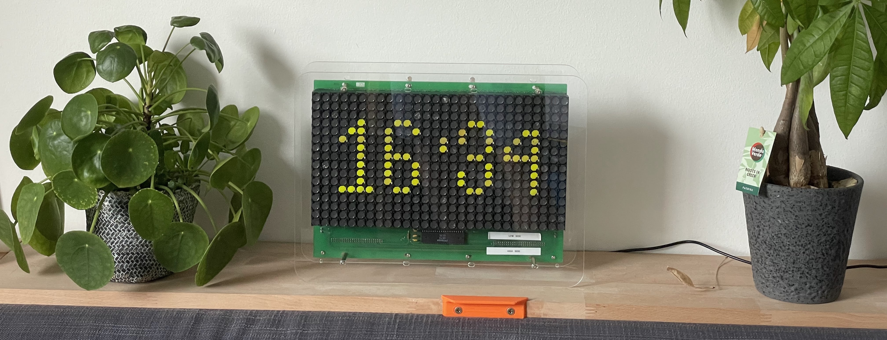
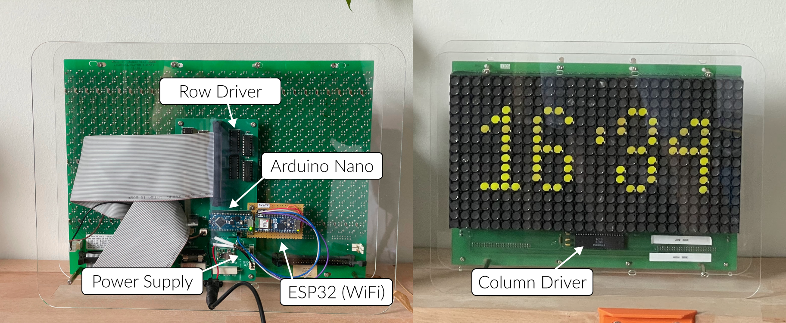
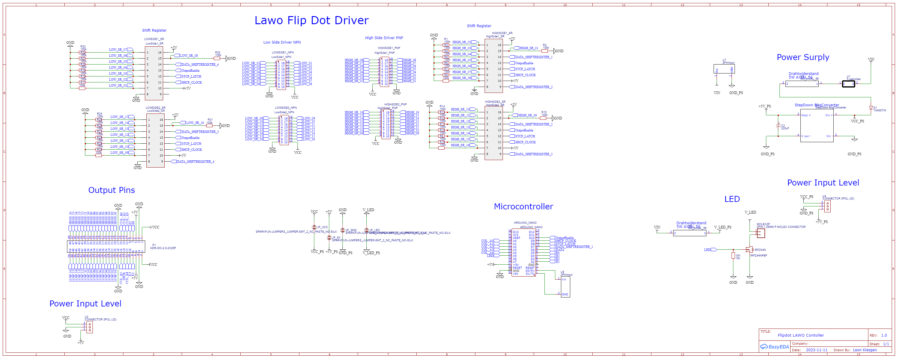

# Reverse Engineering a Old Bus Display - Flipdot Lawo 28x16

## What is a Flipdot Display ?
A flipdot display is a fascinating example of electromechanical display technology, often found on old buses as destination signs. These displays are valued for their retro aesthetics and functional reliability. Each dot in the display is a magnetic disc with one coloured side and one black side. The disc is flipped using an electromagnetic coil which holds the disc in place by magnetic polarisation. This unique operation allows the display to consume power only when changing states, making it highly energy efficient at around 2Wh compared to modern displays that consume around 20-40Wh.

Originally, these displays were controlled by hardware-specific controllers that could only show pre-defined street names or animations. The controller I got from a bus display was no exception and proved unsuitable for my needs. I wanted to create a more versatile solution to control the display, allowing dynamic content such as time, weather and other data downloaded from the internet.

## Final Design

Here is an overview of the final design, which now sits on my shelf.


- 📺 Retro FlipDot Display
- 📟 Custom Row and Column Driver Board (PCB)
- 💻 Arduino Nano Microcontroller
- 🛜 Arduino ESP32 with Wifi
- ⚡ Power Supply



## Development of a new controller board
The main objective was to design and implement a custom controller board for the Flipdot display. This new board would need to drive the 24V operations of the display while interfacing with a microcontroller that supported Wi-Fi. The controller board would handle the complex task of correctly flipping the dots based on the input signals, translating data from the Internet into visible content.

A key objective of the project was to reverse engineer the display architecture. This means understanding the existing PCB schematic, ICs and pin layout of the Fipdot display. But it also meant developing an efficient control layout capable of driving the correct pin with the correct voltage in microseconds. Sounds easy! Probably only for people who study electronics. But even then, modern technologies do not work at the voltage levels required for the project. Each coil of the flipdot is driven by a 100 microsecond pulse of 24V. To flip the same dot back and forth, you have to change the polarity and drive the coil from the other side. This can lead to problems, of course, as flipping at high speed can lead to high voltage short circuits.

I found a schematic on github ( https://github.com/RobsyRocket/Lawo-28x16-Flip-Dot-Matrix-with-LED ).
After understanding the pin layout of my Lawo flip dot matrix, I could do some small tests using a breadboard setup. However, this turned out to be very difficult as I could not flip a single one, only one row at a time. 

The first real prototype was more ambitious, with 16 low-side and high-side lines wired. This was completely designed using a custom perfboard as shown in the following images.




It contained four ``74hc595`` shift registers connected to either ``UDN 2981`` 8 channel high voltage source driver (-500 mA, DIL-18) or ``ULN 2003 AN`` seven Darlington arrays.

After several tests with the display, a major problem with the perfboard was that it was very difficult to add pull-down resistors to each of the shift register outputs. I therefore decided to design a similar circuit on a custom board, including debugging facilities such as decoupling the power supply or adding a fast fuse and board resistor.

The following schematic shows the final design used in my prototype.

It shows the connections to the RX and TX lines of the Arduino, but not the level shifter to the ESP32, as this was decided later in the design process.

The following images show the front of the PCB in both 2D and 3D.





---

